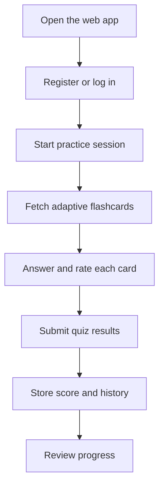

# 🌍 LangFlow

LangFlow is a language learning web application built to help users practice, review, and improve vocabulary and sentence recognition through adaptive flashcard sessions.

## 🌐 Live Access

- Frontend: https://langflow.netlify.app/
- Backend API: https://languageplatformbackend.onrender.com
- API Health Check: https://languageplatformbackend.onrender.com/actuator/health
- Swagger UI: https://languageplatformbackend.onrender.com/swagger-ui/index.html
- Repository: https://github.com/SilveiraGuilherme/LanguagePlatformApplication

## 🚀 What This Project Does

LangFlow is designed as a practical learning tool with a clear user journey:

- Users create an account and log in securely with JWT
- Students start a practice session and receive flashcards dynamically
- Answers are reviewed and rated to guide future card selection
- Quiz results and history are saved for progress tracking
- Protected routes keep student and admin actions separated

## 👥 Main Use Cases

- A learner wants to practice vocabulary in short sessions
- A learner wants to review previous mistakes and improve weak areas
- A learner wants to see quiz scores and session history
- An admin wants access to protected API endpoints for management tasks

## 🔁 How It Works



## 🏗️ Architecture

- Frontend: static web app in `FRONTEND/`
- Backend: Spring Boot REST API in `BACKEND/`
- Database: MySQL hosted on Aiven
- Deployment:
	- Frontend on Netlify
	- Backend on Render using Docker

## 🛠️ Tech Stack

- Java 21
- Spring Boot
- Maven
- MySQL
- JWT authentication
- Swagger/OpenAPI

## 🔐 Security & Environment Setup

The backend expects these environment variables in production:

- `DB_URL` (JDBC connection string)
- `DB_USERNAME`
- `DB_PASSWORD`
- `JWT_SECRET`
- `APP_CORS_ALLOWED_ORIGINS`

The frontend should point to the HTTPS backend in production.

## 🧪 Local Development

1. Import the database schema:

```bash
/usr/local/mysql/bin/mysql -u root -p < BACKEND/schema_local.sql
```

2. Create `BACKEND/.env` from `BACKEND/.env.example`:

```dotenv
DB_URL=jdbc:mysql://localhost:3306/languagelearning?useSSL=false&allowPublicKeyRetrieval=true&serverTimezone=UTC
DB_USERNAME=root
DB_PASSWORD=your_mysql_password
JWT_SECRET=replace_with_a_long_random_secret_at_least_32_chars
APP_CORS_ALLOWED_ORIGINS=http://localhost:5500,http://127.0.0.1:5500
```

3. Run the backend:

```bash
cd BACKEND
./run-local.sh
```

4. Run the frontend:

```bash
cd FRONTEND
python3 -m http.server 5500
```

5. Open the app at:

```text
http://localhost:5500
```

## 📌 Current Limitations

This is a working foundation, but it still needs refinement in a few areas:

- Better mobile responsiveness
- Stronger feedback after quiz submissions
- More detailed learner analytics
- Improved error handling and validation
- More polished admin and reporting tools

## 🚀 Future Improvements

- Add spaced repetition based on performance trends and recent mistakes
- Introduce topic, level, or category filters before each session
- Add streaks, badges, and learner milestones
- Build a dashboard with weekly progress and mastery insights
- Add a review mode for incorrect answers
- Improve accessibility and mobile UX
- Add instructor/admin analytics for learner tracking
- Expand test coverage and end-to-end validation

## 📌 Operational Notes

- Import `BACKEND/schema_local.sql` before the first backend start in any new environment.
- If browser auth behaves unexpectedly during local testing, clear `token`, `user`, `userID`, and `API_BASE_URL` from local storage and log in again.

## 📫 Contact

Guilherme Silveira
gws.silveira@gmail.com
